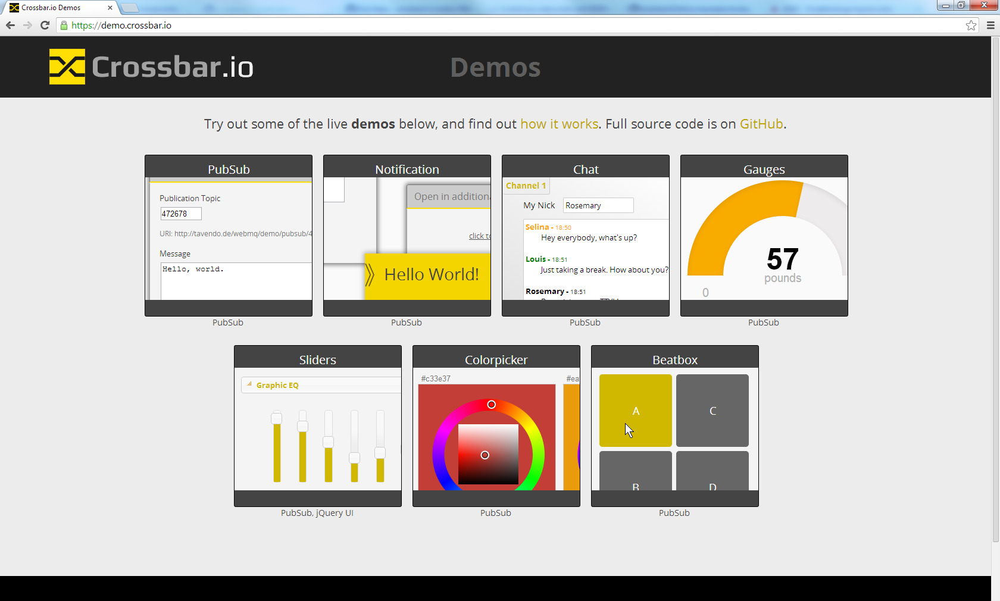
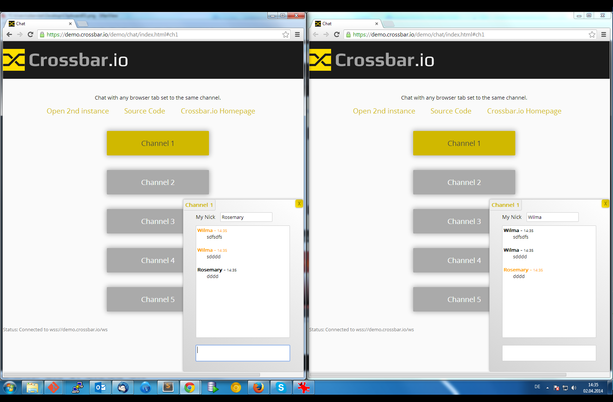

# Crossbar.io Demos

**Crossbar**.io comes with over a [*dozen ready-to-run demos*](https://demo.crossbar.io/) that show off different features of [Crossbar.io](http://crossbar.io/).

The complete demo bundle is available as a [Python package](https://pypi.python.org/pypi/crossbardemo) which you can install into your existing **Crossbar.io** installation and try yourself - see below.

The source-code for the demos can be found in the repository [here](https://github.com/crossbario/crossbardemo/web) and is [open-source licensed](https://github.com/crossbario/crossbardemo/blob/master/LICENSE) under the Apache 2.0 license. This allows you to *reuse the code even in commercial projects* for use as starting points in your development.

## Try it

### 1) Install the Demos

To install from [PyPI](https://pypi.python.org/pypi/crossbardemo)

```shell
pip install crossbardemo
```

To upgrade an existing package from PyPI
	
```shell
pip install --upgrade crossbardemo
```

### 2) **Create** a new **Crossbar**.io node

```shell
cd $HOME
mkdir demo1
cd demo1
crossbar init --template demos
```

and start

```shell
cd $HOME/demo1
crossbar start
```

**Crossbar**.io will log startup

```shell
$ crossbar start
2014-04-02 14:48:08+0200 [Controller 136] Log opened.
2014-04-02 14:48:08+0200 [Controller 136] ============================== Crossbar.io ==============================
...
2014-04-02 14:48:10+0200 [Controller 136] Worker 3740: Class 'crossbardemo.basic.TimeService' (1) started in realm 'realm1' on router 101
2014-04-02 14:48:10+0200 [Controller 136] Worker 3740: Class 'crossbardemo.basic.TickService' (2) started in realm 'realm1' on router 101
2014-04-02 14:48:10+0200 [Controller 136] Worker 3740: Class 'crossbardemo.basic.MathService' (3) started in realm 'realm1' on router 101
2014-04-02 14:48:10+0200 [Worker 3740] Loaded static Web resource 'web' from module 'crossbardemo 0.3.2' (filesystem path c:\Python27\lib\site-packages\crossbardemo\web)
2014-04-02 14:48:10+0200 [Worker 3740] Site starting on 8080
...
```

### 3) Test the Demos

Open the demos entry page at `http://127.0.0.1:8080` in your browser



Then, for example, open the "Chat" demos in two browser tabs to see it communicate in real-time



